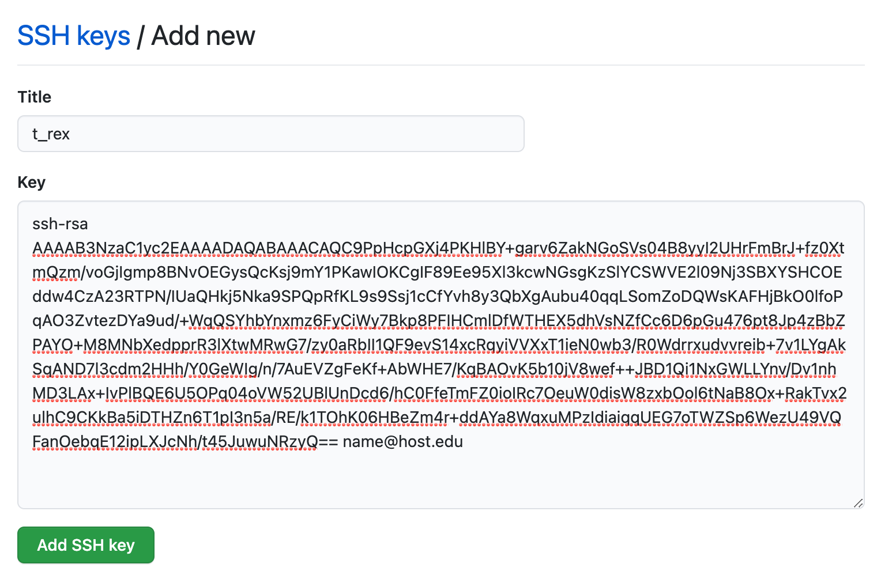

## Watch Week 2 Session on Youtube

- Youtube link will be posted on the day after the session.

<center>

</center>

<br><br>

## Table of Contents

- [1. Staying Current with a Remote Repository](#staying-current-with-a-remote-repository)
	
	- [1.1 Copying or Cloning a Repository](#copying-or-cloning-a-repository)

	- [1.2 Keeping the Clone Current with Upstream](#keeping-the-clone-current-with-upstream)

- [2. Secure Communication with GitHub](#secure-communication-with-github)

	- [2.1 Generate SSH Key Pair](#generate-ssh-key-pair)

	- [2.2 Associate Public Key with GitHub](#associate-public-key-with-github)

	- [2.3 Configure Your System to Use SSH Keys](#configure-your-system-to-use-ssh-keys)

	- [2.4 Test Your SSH Key](#test-your-ssh-key)	

<br><br><br><br><br>
<br><br><br><br><br>
<br><br><br><br><br>
<br><br><br><br><br>
<br><br><br><br><br>
<br><br><br><br><br>

## 1. Staying Current with a Remote Repository

The official repository of Summer of Code 2021 is located at [https://github.com/wyoibc/soc2021](https://github.com/wyoibc/soc2021). Now that you have started following its contents, it makes sense to (1) have a copy of it on your computer, and (2) learn how to keep your copy current with what is upstream (i.e. on GitHub).  If you were to copy this repository right now, you will have the most current version of it. But once I make any changes to the upstream, your copy will become slightly stale.  In this section, we will learn how to make it current again.


### 1.1 Copying or Cloning a Repository

- Using the following command in your terminal session, clones the remote repository to the current location.  So be sure to navigate within your terminal to a place where you wish to make a copy.  

```bash
cd ~/Github

git clone https://github.com/wyoibc/soc2021
```

<br>

### 1.2 Keeping the Clone Current with Upstream

- You don't have to know if the remote has changed; git will do that for you.  The following command will allow git to check your copy against the remote. If they are different, git will download updates and merge them with your copy. If they are identical, git will tell you so and it won't make any changes.


```bash
git pull
```

- You can use ``git pull`` as often as you wish. For SOC2021, it is probably sufficient to pull it once a week. If you begin working on a project that is being updated more frequently, then you will benefit from pulling more often.


<br><br>

## 2. Secure Communication with GitHub

- When you used your login credentials to push contents of your local repository to a new and empty remote GitHub repository, you may have received an email-notice from GitHub that this method of authentication is *deprecated*. That's computer science lingo for "about to be phased out". What that means is that sometime soon, using username and password to push contents to github will no longer work (don't confuse this with logging onto Github.com, which will still use those credentials.

- Instead, you will be using a much more secure form of login called ``SSH``, short for **S**ecure **SH**ell. A SSH password is called a ``key``, which is much longer than a typical, secure password. But perhaps even more importantly, it is encrypted.

- A SSH key comes as a pair of a public password, and a private password.  You provide your public part to others who you wish to securely communicate with (i.e. Github in this instance). The private key should never be shared with anyone for any purpose. It will sit securely on your computer inside a hidden folder.

- In this section, we will generate a SSH key pair and then associate the public key with your Github.com account.  

<br>

### 2.1 Generate SSH Key Pair

- On Macintosh and other Unix-like systems, SSH key pair can be generated using a program called ``ssh-keygen``. It comes preinstalled with the OS. Windows users should be able to access this program inside ``git bash``.


```bash
ssh-keygen -t rsa -b 4096 -C "name@host.edu"
```

- Here, ``-t rsa`` flag tells the program to use ``RSA`` encryption algorithm when generating the private key.  RSA stands for first initials of the three authors who developed this algorithm (Rivest, Shamir & Adleman) in 1977.

- ``-b`` flag denotes amount of bits to use (size of the key)

- ``-C`` flag allows a comment, which in this case is your email address associated with github. It will become part of your key.

- Once you hit enter, your system will present the following dialogue:

```bash
Generating public/private rsa key pair.
Enter file in which to save the key (/Users/wyoibc/.ssh/id_rsa): 
```

- Notice that the keys will be stored inside your home directory in a hidden folder named ``.ssh``.  

- By default the keys are named: ``id_rsa`` (private) and ``id_rsa.pub`` (public). But you don't have to keep this name. If you wish to change is, type it out. An example could be: ``/Users/wyoibc/.ssh/t_rex``.  If you want to keep the default, just hit enter.

- Next, the system will ask if you want to protect these keys with a passphrase. If you choose to enter a passphrase, you will need to memorize it and the system will ask you to enter it everytime you wish to use the key. I personally always use a passphrase. 

```bash
Enter passphrase (empty for no passphrase): 

Your identification has been saved in /Users/wyoibc/.ssh/t_rex.
Your public key has been saved in /Users/wyoibc/.ssh/t_rex.pub.
The key fingerprint is:
SHA256:4ps5bMhN7293Grtr0v+dCsUI4Ji02WQL9v+Wut7uOu4 name@host.edu
The key's randomart image is:
+---[RSA 4096]----+
|     + +         |
|    o % o        |
|     = = .       |
|        . . o    |
|      . S. . o   |
|     ...  . o    |
|   . =..   *.    |
|    o =+..* =o. o|
|     .+o=EBB=Booo|
+----[SHA256]-----+
```

<br>

### 2.2 Associate Public Key with GitHub

- Next we need to copy our public key and associate it with our GitHub account.


```bash
cd /Users/wyoibc/.ssh/

pbcopy < t_rex.pub  
```

- The key has now been copied to your clipboard.

- Next, go to GitHub.com and login to your account. Choose settings, and then SSH keys as follows:


<br>
<center>
 
</center>
<br>


- Click on ``New SSH key`` and use ``ctrl+V`` to paste your public key into the available box and choose a title. Leave no spaces in the title. A title is just an identifier for your key. Finally, choose ``Add SSH key`` to complete the process.


<br>
<center>
 
</center>
<br>

- Once you have added the key, it will appear in your account as follows:

<br>
<center>
 
</center>
<br>


<br>

### 2.3 Configure Your System to Use SSH Keys

- First, make sure that ``ssh-agent`` is enabled on your system, and add your newly created ssh key to the agent. If you set up a passphrase earlier, you will need to enter it now.

```bash
ssh-agent -s

ssh-add /Users/wyoibc/.ssh/t_rex
```

- Make sure that the ssh-agent is using your key.

```bash
ssh-add -l

4096 SHA256:uMFoUIUC7osmgDQaNowsOnqEt3XmPPZe4RnR2+Q1KB0 name@host.edu (RSA)
```

- Second, open the configuration file for ssh

```bash
cd /Users/wyoibc/.ssh

vim config
```

- If this file doesn't exist, you will be creating a new one.  Add following lines to this file:


```bash
Host *
   AddKeysToAgent yes
   UseKeychain yes

Host wyoibc.github.com
        HostName github.com
        User git
        PreferredAuthentications publickey
        IdentityFile ~/.ssh/t_rex

```

- Save and close the file.


```bash
:wq
```


<br>

### 2.4 Test Your SSH Key

- Now let's go back and make some changes to the git repository we created last time: ``testgit``.

- Let's create a new plot to include number of deaths from COVID-19 over the same time period as before.

```bash
cd /Users/wyoibc/Dropbox/Github/testgit
```

- Use R to load the data and redraw the scatterplot as before.

```r
df <- read.csv("us.csv", header=T)

plot(1:489, df$deaths, pch=16, col="salmon", cex=0.5, xlab="Days", ylab="Num. Deaths")
```

- Save this plot as before, but combine it with the previous plot to make a one-row, two-column multi-plot.  


```r
png("covid_combined.png", width=10, height=7, unit="in", res=600)

par(mfrow=c(1,2), mar=c(5,4,4,2), oma=c(2,2,2,2))

plot(1:489, df$cases, pch=16, col="darkgreen", cex=0.5, xlab="Days", ylab="Num. Cases")

plot(1:489, df$deaths, pch=16, col="salmon", cex=0.5, xlab="Days", ylab="Num. Deaths")

title(main="COVID-19 Cases and Deaths 2020-21", outer=TRUE, cex.main=0.9)

dev.off()

```


- Next modify your README.md to exclude the previous plot and include the new one.


```bash
---
title: COVID-19 Cases & Deaths
author: Vikram Chhatre
date: June 1, 2021
---

1. The following plot shows number of COVID-19 cases and deaths in the United States from January 2020 through May 2021.


<center>

</center>

```

- Save and close the file. Then add and commit the changes. But don't push yet.  We need to change our authentication method.


```bash
git add .

git commit -m "Added a new plot"

```

- Open up the git config file in testgit:


```bash
cd /Users/wyoibc/Dropbox/Github/testgit/.git

vim config
```

- Find the URL setting and change it as follows by substituting your own user name

```bash
url = git@github.com:wyoibc/testgit.git
```

- Finally, push. Now you should not get a password prompt.


```bash
git push
```


 
