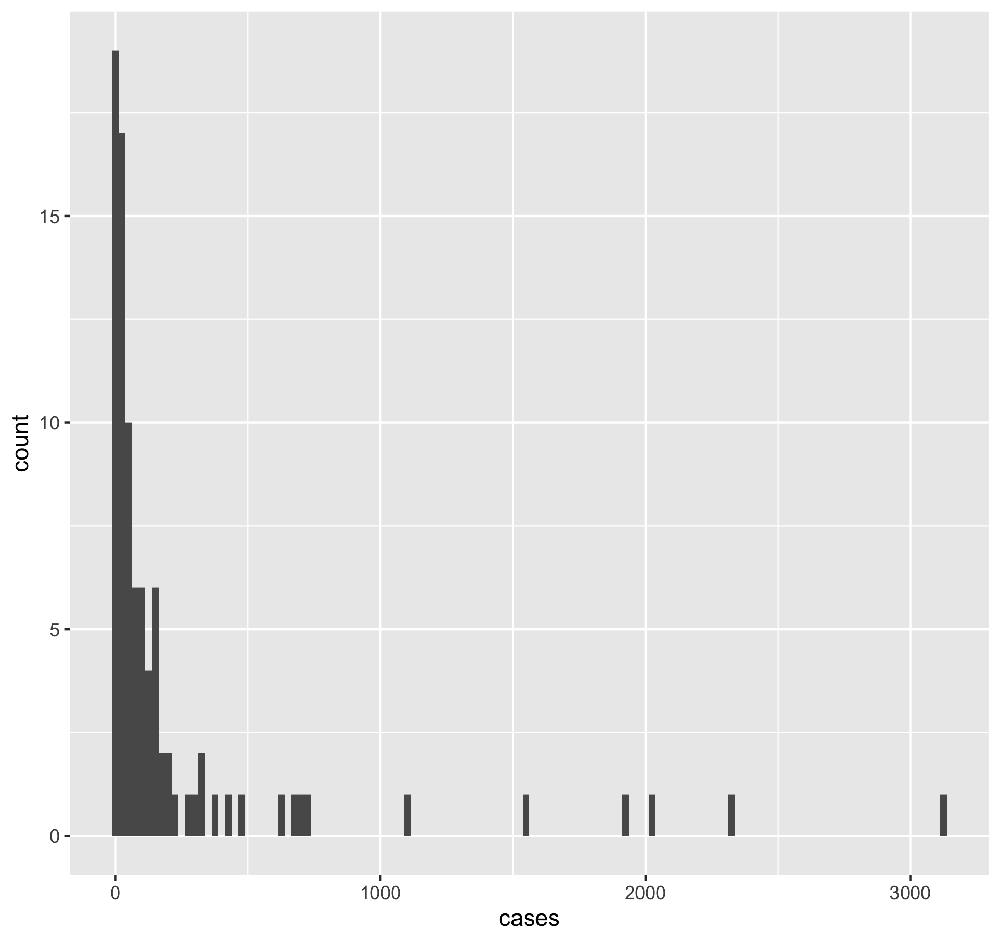
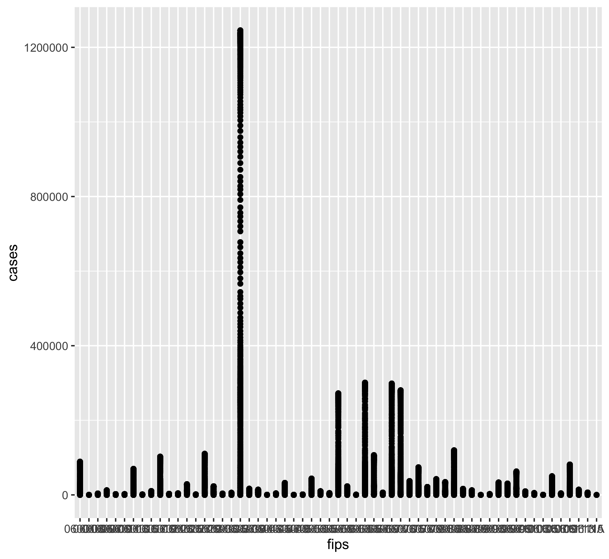
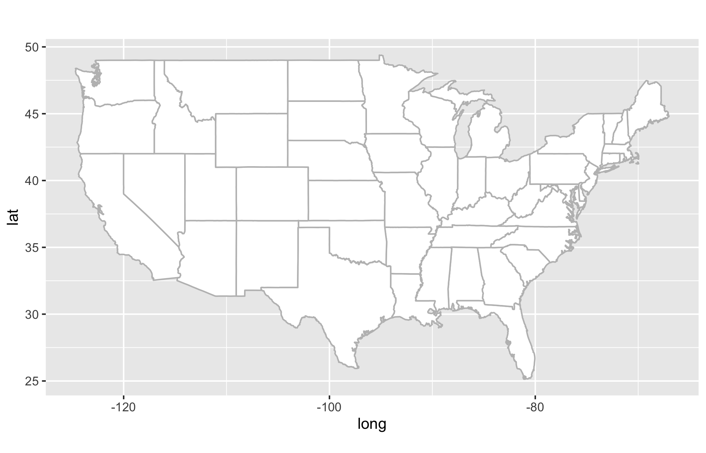
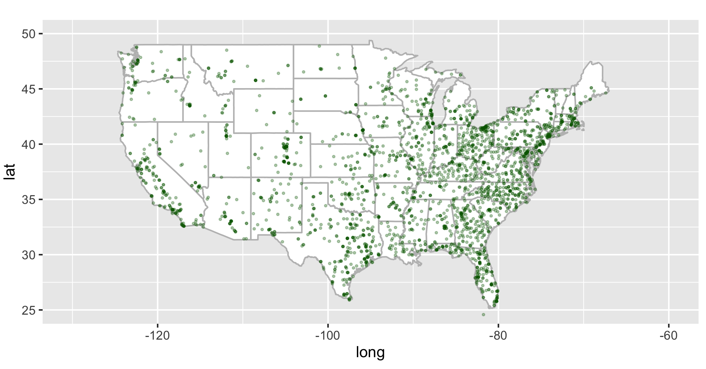

**Note**: Before you begin, make sure to ``git pull`` this repository to bring your local repo up to date with the online one.

<br><br>


## Table of Contents

- [1. Tidyverse Packages and Installation](#tidyverse-packages-and-installation)

- [2. Data Sets](#data-sets)

- [3. Importing Data into R](#importing-data-into-r)

	- [3.1 Clone NYT COVID Data](#clone-nyt-covid-data)

	- [3.2 Import College Cases Data](#import-college-cases-data)

- [4. Exploring Data](#exploring-data)

	- [4.1 Using Pipes (``%>%``)](#using-pipes)

	- [4.2 Accessing Specific Data from Tibbles](#accessing-specific-data-from-tibbles)

	- [4.3 Exploratory Visualization](#exploratory-visualization)
	
	- [4.4 Exercises](#exercises)

	- [4.5 Visualizing Data on Maps](#visualizing-data-on-maps)


<Br><br><br><br>
<Br><br><br><br>
<Br><br><br><br>
<Br><br><br><br>
<Br><br><br><br>
<Br><br><br><br>
<Br><br><br><br>
<Br><br><br><br>
<Br><br><br><br>
<Br><br><br><br>
<Br><br><br><br>
<Br><br><br><br>
<Br><br><br><br>
<Br><br><br><br>
<Br><br><br><br>
<Br><br><br><br>
<Br><br><br><br>
<Br><br><br><br>

## 1. Tidyverse Packages and Installation

- We will be working with many of the following packages in this session:

	- ``readr``: Efficiently import data into R
	
	- ``tibble``: The spreadsheet workhose of Tidyverse

	- ``dplyr``: Data manipulation

	- ``tidyr``: Tidy your data

	- ``ggplot2``: A different grammar of graphics

	- ``forcats``: Simplify factors

	- ``purrr``: Repetitive tasks


- While you can install them one package at a time, you can also install all at once:

	```r
	install.packages("devtools")

	devtools::install_github("hadley/tidyverse")
	```


<br><br><br>

## 2. Data Sets

- Example data sets included with packages tend to be generally not from biology. For today's exercises, we will be using many of the following data sets instead. All data sets are now part of this repository, which you can access by doing ``git pull``.

	- NYT COVID-19 Datasets

	- 

<br><br><br>


## 3. Importing Data into R

- [Tidyverse](https://tidyverse.org) package [readr](https://readr.tidyverse.org) has an improved set of functions over their base-R counterparts. These functions are a lot faster, which is advantageous when reading very large data sets. For such large files, readr functions have a progress bar showing the amount of data read in real time. In base-R, you are just waiting for the prompt to return.

	- ``read_csv`` (base-R: ``read.csv``)

	- ``read_tsv`` (base-R: ``read.table``)

	- ``read_delim`` (base-R: ``read_delim``)

	- ``read_log`` (no base-R function)


- When you read in a data frame (i.e. a spreadsheet), with any type of column delimiter (comma, tab, space or some other symbol), readr converts it into a format called ``tibble``, which is a modified data frame.  A ``tibble`` provides many ease of use features as we will see below.


### 3.1 Clone NYT COVID Data

- Use the ``git clone`` function on [github.com/nytimes/covid-19-data](https://github.com/nytimes/covid-19-data) to make a local copy.

<br><br>

### 3.2 Import college cases data

- Once you clone the above repository, take a look at the contents. We are going to use data inside the ``colleges`` folder.

```bash

cd covid-19-data/

ls -lh

-rw-r--r--@ 1 vikram  staff   1.3K Feb 24 06:41 LICENSE
-rw-r--r--@ 1 vikram  staff   2.7K Feb 24 06:41 NEW-YORK-DEATHS-METHODOLOGY.md
-rw-r--r--@ 1 vikram  staff   3.1K Feb 24 06:41 PROBABLE-CASES-NOTE.md
-rw-r--r--@ 1 vikram  staff    21K Jun  7 18:28 README.md
drwxr-xr-x@ 4 vikram  staff   128B Jun  7 18:28 colleges
drwxr-xr-x@ 4 vikram  staff   128B Feb 24 06:41 excess-deaths
drwxr-xr-x@ 5 vikram  staff   160B Jun  7 18:28 live
drwxr-xr-x@ 4 vikram  staff   128B Feb 24 06:41 mask-use
drwxr-xr-x@ 5 vikram  staff   160B Jun  7 18:28 prisons
drwxr-xr-x@ 8 vikram  staff   256B Jun  7 18:28 rolling-averages
-rw-r--r--@ 1 vikram  staff   3.9M Jun  7 18:28 us-counties-recent.csv
-rw-r--r--@ 1 vikram  staff    55M Jun  7 18:28 us-counties.csv
-rw-r--r--@ 1 vikram  staff   855K Jun  7 18:28 us-states.csv
-rw-r--r--@ 1 vikram  staff    12K Jun  7 18:28 us.csv

cd colleges

ls -lh

-rw-r--r--@ 1 vikram  staff   6.6K Jun  7 18:28 README.md
-rw-r--r--@ 1 vikram  staff   157K Jun  7 18:28 colleges.csv
```

- The ``README.md`` file contains metadata and other details for the information stored inside ``colleges.csv``.  

- Use the ``read_csv`` function to import the data into R. Make sure to use the tidyverse function, which has an ``_`` instead of the base-R ``.``.


```r

library(tidyverse)

college <- read_csv("colleges.csv")

── Column specification ──────────────────
cols(
  date = col_date(format = ""),
  state = col_character(),
  county = col_character(),
  city = col_character(),
  ipeds_id = col_character(),
  college = col_character(),
  cases = col_double(),
  cases_2021 = col_double(),
  notes = col_character()
)
```

- You will notice that unlike the base-R function, ``read_csv`` tells you how it has interpreted data in each of the columns. There are several types of identifiers here as follows:

	- ``col_date``
	
	- ``col_character``

	- ``col_double``

- These are data type specifications implemented by ``readr``. For example, the column with ``date`` header is being correctly identified as date time data.  Information in column ``state`` is being read correctly as characters, and finally number of cases (``cases``) is being read as double, which is a type of numerical data.


- Let's now check what our data looks like:


```r
college

# A tibble: 1,948 x 9
   date       state  county  city   ipeds_id college      cases cases_2021 notes
   <date>     <chr>  <chr>   <chr>  <chr>    <chr>        <dbl>      <dbl> <chr>
 1 2021-05-26 Alaba… Madison Hunts… 100654   Alabama A&M…    41         NA NA   
 2 2021-05-26 Alaba… Montgo… Montg… 100724   Alabama Sta…     2         NA NA   
 3 2021-05-26 Alaba… Limest… Athens 100812   Athens Stat…    45         10 NA   
 4 2021-05-26 Alaba… Lee     Auburn 100858   Auburn Univ…  2742        567 NA   
 5 2021-05-26 Alaba… Montgo… Montg… 100830   Auburn Univ…   220         80 NA   
 6 2021-05-26 Alaba… Walker  Jasper 102429   Bevill Stat…     4         NA NA   
 7 2021-05-26 Alaba… Jeffer… Birmi… 100937   Birmingham-…   263         49 NA   
 8 2021-05-26 Alaba… Limest… Tanner 101514   Calhoun Com…   137         53 NA   
 9 2021-05-26 Alaba… Tallap… Alexa… 100760   Central Ala…    49         10 NA   
10 2021-05-26 Alaba… Coffee  Enter… 101143   Enterprise …    76         35 NA   
# … with 1,938 more rows
```

- As you will notice, readr has converted this data frame into a tibble, and it shows some useful information about the file instead of just spitting out all columns and all rows to the screen.  Below each column header, a tibble identifies the type of data contained within it (enclosed within ``<>``). 

- A tibble will always print the first 10 rows of data unless you ask for more. Depending upon the number of columns available in the data, it will also show only as many as it can comfortably fit on screen. 

<br><br>

## 4. Exploring Data

<br>

### 4.1 Using Pipes

- If you are familiar with the pipe function in Unix (``|``), the R pipe works similarly (albeit it uses a different symbol). The goal is to use output from one command and pass it onto another function. Just like the Unix pipe, the R pipe can also be nested as many times as you want.  We will see some examples below.

- What if you wanted to print 15 rows of data from the above tibble to the screen?

```r
college %>% print(n=15, width=Inf)

# A tibble: 1,948 x 9
   date       state   county     city           ipeds_id college                              cases cases_2021 notes
   <date>     <chr>   <chr>      <chr>          <chr>    <chr>                                <dbl>      <dbl> <chr>
 1 2021-05-26 Alabama Madison    Huntsville     100654   Alabama A&M University                  41         NA NA   
 2 2021-05-26 Alabama Montgomery Montgomery     100724   Alabama State University                 2         NA NA   
 3 2021-05-26 Alabama Limestone  Athens         100812   Athens State University                 45         10 NA   
 4 2021-05-26 Alabama Lee        Auburn         100858   Auburn University                     2742        567 NA   
 5 2021-05-26 Alabama Montgomery Montgomery     100830   Auburn University at Montgomery        220         80 NA   
 6 2021-05-26 Alabama Walker     Jasper         102429   Bevill State Community College           4         NA NA   
 7 2021-05-26 Alabama Jefferson  Birmingham     100937   Birmingham-Southern College            263         49 NA   
 8 2021-05-26 Alabama Limestone  Tanner         101514   Calhoun Community College              137         53 NA   
 9 2021-05-26 Alabama Tallapoosa Alexander City 100760   Central Alabama Community College       49         10 NA   
10 2021-05-26 Alabama Coffee     Enterprise     101143   Enterprise State Community College      76         35 NA   
11 2021-05-26 Alabama Etowah     Gadsden        101240   Gadsden State Community College         67          5 NA   
12 2021-05-26 Alabama Montgomery Montgomery     101435   Huntingdon College                       0         NA NA   
13 2021-05-26 Alabama Calhoun    Jacksonville   101480   Jacksonville State University          229         10 NA   
14 2021-05-26 Alabama Covington  Andalusia      101602   Lurleen B. Wallace Community College    19         NA NA   
15 2021-05-26 Alabama Perry      Marion         101648   Marion Military Institute               45         19 NA   
```

- In the example above, we used ``Inf`` option for the width of the tibble.  Because this tibble is small, it fits comfortable on our screen. However, if your tibble was much wider than this, you could restrict the width to match that of your display. For example, try the following three commands and try to notice the differences between the three outputs:


```r
college %>% print(n=15, width=150)

college %>% print(n=15, width=100)

college %>% print(n=15, width=70)
```

- What was different about the outputs?


- If you wanted to find out how many different institutions have been represented in this data set:

```r
college %>% count(college)

# A tibble: 1,936 x 2
   college                                                                     n
   <chr>                                                                   <int>
 1 Abilene Christian University                                                1
 2 Abraham Baldwin Agricultural College                                        1
 3 Academy of Art University                                                   1
 4 Adams State University                                                      1
 5 Adelphi University                                                          1
 6 Adirondack Community College                                                1
 7 Adrian College                                                              1
 8 AdventHealth University                                                     1
 9 Agnes Scott College                                                         1
10 Air Force Institute of Technology-Graduate School of Engineering & Man…     1
# … with 1,926 more rows
```

This shows that there are a total of 1936 institutions covered here. ``count`` is a function from the library ``dplyr``, part of core Tidyverse.  The pipe (``%>%``) is not part of tidyverse; it comes from a package named ``magritter`` which is a dependency for tidyverse.


<Br><br>

### 4.2 Accessing Specific Data from Tibbles

- Let's say we wish to access data from Nevada.


```r
college %>% filter(state="Nevada")

# A tibble: 7 x 9
  date       state  county      city        ipeds_id college                           cases cases_2021 notes
  <date>     <chr>  <chr>       <chr>       <chr>    <chr>                             <dbl>      <dbl> <chr>
1 2021-05-26 Nevada Clark       Las Vegas   182005   College of Southern Nevada          440        111 NA   
2 2021-05-26 Nevada Elko        Elko        182306   Great Basin College                  43          9 NA   
3 2021-05-26 Nevada Clark       Henderson   441900   Nevada State College                 48         10 NA   
4 2021-05-26 Nevada Washoe      Reno        182500   Truckee Meadows Community College    58         10 NA   
5 2021-05-26 Nevada Clark       Las Vegas   182281   University of Nevada, Las Vegas     719        212 NA   
6 2021-05-26 Nevada Washoe      Reno        182290   University of Nevada, Reno         1544        335 NA   
7 2021-05-26 Nevada Carson City Carson City 182564   Western Nevada College               53          4 NA   
```

- What if you want to print 20 rows of data from Nevada?


```r
college %>% filter(state="Nevada") %>% print(n=20)
```

- You will notice that only 7 rows are printed still. This is because there is probably not more data for Nevada. Try the same command on Texas:

```r
college %>% filter(state="Texas) %>% print(n=20)
```

- What if you only want to print the following columns from Hawaii: date, state, county and cases?

```r
college %>% filter(state="Hawaii") %>% select(1:3, 7)

# A tibble: 9 x 4
  date       state  county   cases
  <date>     <chr>  <chr>    <dbl>
1 2021-05-26 Hawaii Honolulu    55
2 2021-05-26 Hawaii Honolulu     1
3 2021-05-26 Hawaii Honolulu     1
4 2021-05-26 Hawaii Honolulu     5
5 2021-05-26 Hawaii Honolulu     4
6 2021-05-26 Hawaii Maui         2
7 2021-05-26 Hawaii Hawaii      10
8 2021-05-26 Hawaii Honolulu    73
9 2021-05-26 Hawaii Honolulu     2
```
 
- Notice that we used column numbers above instead of their names. But of course, you could achieve the same result using names:

```r
college %>% filter(state=="Hawaii") %>% select("date", "state", "county", "cases")
```


- Repeat the last command with California:

```r
col %>% filter(state=="California") %>% select("date", "state", "county", "cases") 
# A tibble: 90 x 4
   date       state      county          cases
   <date>     <chr>      <chr>           <dbl>
 1 2021-05-26 California San Francisco       0
 2 2021-05-26 California Los Angeles       101
 3 2021-05-26 California Los Angeles       108
 4 2021-05-26 California Kern                0
 5 2021-05-26 California Los Angeles        99
 6 2021-05-26 California Riverside          25
 7 2021-05-26 California Los Angeles       123
 8 2021-05-26 California Ventura            47
 9 2021-05-26 California San Luis Obispo  2021
10 2021-05-26 California Los Angeles        61
# … with 80 more rows
```
- California data consists of 90 rows altogether.  

- You have just used two new functions from the ``dplyr`` package. If you are curious about details of these functions, you can always look at the package help menu:


```r
?filter

Help on topic ‘filter’ was found in the following packages:

  Package               Library
  dplyr                 /Library/Frameworks/R.framework/Versions/4.0/Resources/library
  stats                 /Library/Frameworks/R.framework/Versions/4.0/Resources/library
```

- As you see above, sometimes same function names are used in multiple packages.  To choose the correct one, be more explicit as follows:

```r
?dplyr::filter

?dplyr::select
```


<Br><br>

### 4.3 Exploratory Visualization

- Pipes make it very easy to subset data and plot it on the fly without creating any additional objects. This functionality is rather useful when exploring the data.

```r
col %>% filter(state=="California") %>% select("date", "state", "county", "cases")  %>% ggplot() + geom_point(aes(x=date, y=cases))
```

<center>
 </img>
</center>

- The data that we are currently exploring is rather limited. Let's bring in a larger data set.


```r
setwd("../covid-19-data")

list.files()

 [1] "colleges"                       "excess-deaths"                  "LICENSE"                        "live"                          
 [5] "mask-use"                       "NEW-YORK-DEATHS-METHODOLOGY.md" "prisons"                        "PROBABLE-CASES-NOTE.md"        
 [9] "README.md"                      "rolling-averages"               "us-counties-recent.csv"         "us-counties.csv"               
[13] "us-states.csv"                  "us.csv" 
```


- Bring in the US counties data set


```r
counties <- read_csv("us-counties.csv")

counties

# A tibble: 1,394,421 x 6
   date       county      state      fips  cases deaths
   <date>     <chr>       <chr>      <chr> <dbl>  <dbl>
 1 2020-01-21 Snohomish   Washington 53061     1      0
 2 2020-01-22 Snohomish   Washington 53061     1      0
 3 2020-01-23 Snohomish   Washington 53061     1      0
 4 2020-01-24 Cook        Illinois   17031     1      0
 5 2020-01-24 Snohomish   Washington 53061     1      0
 6 2020-01-25 Orange      California 06059     1      0
 7 2020-01-25 Cook        Illinois   17031     1      0
 8 2020-01-25 Snohomish   Washington 53061     1      0
 9 2020-01-26 Maricopa    Arizona    04013     1      0
10 2020-01-26 Los Angeles California 06037     1      0
# … with 1,394,411 more rows
```

- This consists of data from the beginning of the pandemic up until very recent.  Just to get a handle on the range of dates for which this data is available, do this:

```r
> range(counties$date)
[1] "2020-01-21" "2021-06-06"
```

- Let's subset the data for the state of California again


```r
counties %>% filter(state=="California")

# A tibble: 25,907 x 6
   date       county      state      fips  cases deaths
   <date>     <chr>       <chr>      <chr> <dbl>  <dbl>
 1 2020-01-25 Orange      California 06059     1      0
 2 2020-01-26 Los Angeles California 06037     1      0
 3 2020-01-26 Orange      California 06059     1      0
 4 2020-01-27 Los Angeles California 06037     1      0
 5 2020-01-27 Orange      California 06059     1      0
 6 2020-01-28 Los Angeles California 06037     1      0
 7 2020-01-28 Orange      California 06059     1      0
 8 2020-01-29 Los Angeles California 06037     1      0
 9 2020-01-29 Orange      California 06059     1      0
10 2020-01-30 Los Angeles California 06037     1      0
# … with 25,897 more rows
```

- Let's plot the number of cases per county in California


```r
counties %>% filter(state == "California) %>% ggplot() + geom_point(aes(x=fips, y=cases))
```

<center>

</center>


- It seems that one of the counties has disproportionately higher number of cases. How would we find out what county that is?


```r
counties %>% filter(state == "California") %>% filter(cases > 1200000)

# A tibble: 94 x 6
   date       county      state      fips    cases deaths
   <date>     <chr>       <chr>      <chr>   <dbl>  <dbl>
 1 2021-03-05 Los Angeles California 06037 1200764  21910
 2 2021-03-06 Los Angeles California 06037 1202513  22008
 3 2021-03-07 Los Angeles California 06037 1203799  22029
 4 2021-03-08 Los Angeles California 06037 1204665  22041
 5 2021-03-09 Los Angeles California 06037 1205924  22099
 6 2021-03-10 Los Angeles California 06037 1207361  22213
 7 2021-03-11 Los Angeles California 06037 1208672  22304
 8 2021-03-12 Los Angeles California 06037 1208678  22304
 9 2021-03-13 Los Angeles California 06037 1210286  22446
10 2021-03-14 Los Angeles California 06037 1210920  22474
# … with 84 more rows
```

- What do the numbers look like for deaths?


```r
counties %>% filter(state == "California") %>% ggplot() + geom_point(aes(x=fips, y=deaths))
```


<center>

</center>


- A quick eyeballing points likely to the same county for largest number of deaths. Just to verify:

```r
counties %>% filter(state == "California") %>% filter(deaths > 10000)

# A tibble: 159 x 6
   date       county      state      fips   cases deaths
   <date>     <chr>       <chr>      <chr>  <dbl>  <dbl>
 1 2020-12-30 Los Angeles California 06037 756412  10056
 2 2020-12-31 Los Angeles California 06037 770915  10345
 3 2021-01-01 Los Angeles California 06037 790895  10552
 4 2021-01-02 Los Angeles California 06037 806523  10682
 5 2021-01-03 Los Angeles California 06037 818959  10773
 6 2021-01-04 Los Angeles California 06037 827843  10850
 7 2021-01-05 Los Angeles California 06037 840956  11071
 8 2021-01-06 Los Angeles California 06037 852510  11328
 9 2021-01-07 Los Angeles California 06037 871749  11545
10 2021-01-08 Los Angeles California 06037 889787  11863
# … with 149 more rows
```

- Now try to make the last two plots for your home state and find out which county had the highest number of cases and deaths.  Report back on Slack channel with county name and associated numbers.

<br><br>

### 4.3 Exercises

1. Access the ``prisons/`` directory within the NYT covid-19-data repository and import the ``facilities.csv`` data into R (store it as an object ``fac``).

2. How many rows and columns of data is present in the facilities data set?

3. Use the pipe function to display only these columns: facility name, state, inmate cases, inmate deaths 

4. Count the total number of prison facilities.

5. Count the number of facilities per state.

6. Using the ``fac_sub`` tibble make a scatterplot of inmate cases vs inmate deaths in ggplot.

7. Which state had the highest number of inmate cases or deaths?


<br><br>

### 4.5 Visualizing Data on Maps

- First install the following two packages:

	- ``maps``
	
	- ``mapdata``

- Load the packages

- Create base USA map object

```r
usa <- map_data('usa')

states <- map_data('state')

usa_base <- ggplot(data=states) + geom_polygon(aes(x=long, y=lat, fill=I('white'), group=group), color='gray') + coord_fixed(1.3) + guides(fill=FALSE)
```

- Print basic USA map to the screen

```r
usa_base
```

<center>

</center>

- Add locations of the prison facilities to the map

```r
usa_base + geom_point(data=fac, aes(x=facility_lng, y=facility_lat), color="darkgreen", cex=0.5, alpha=3/10) + coord_fixed(xlim=c(-130, -60), ylim=c(25,50), ratio=1.3)
```


<center>

</center>


	

