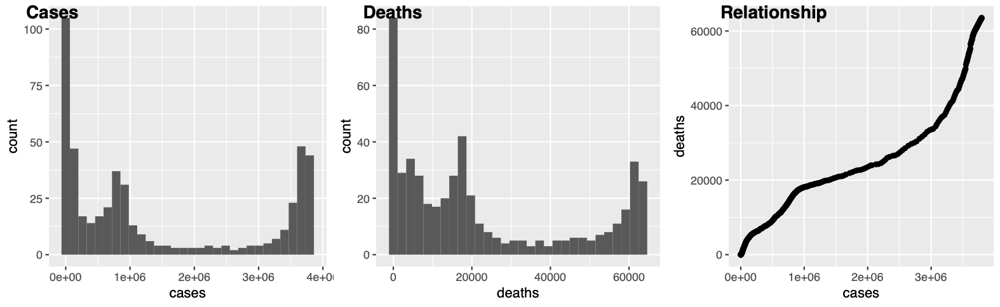

## Table of contents

- [1. Questions from last week](#questions-from-last-week)

	- [1.1 Summary statistics](#is-there-a-way-to-run-summary-stats-in-tidyverse)

	- [1.2 Multi-panel figures](#how-to-plot-multipanel-figures-in-ggplot2)

	- [1.3 Exercises](#exercises)


<Br><br><br><br>
<Br><br><br><br>
<Br><br><br><br>
<Br><br><br><br>
<Br><br><br><br>
<Br><br><br><br>
<Br><br><br><br>
<Br><br><br><br>
<Br><br><br><br>
<Br><br><br><br>
<Br><br><br><br>
<Br><br><br><br>
<Br><br><br><br>
<Br><br><br><br>
<Br><br><br><br>
<Br><br><br><br>
<Br><br><br><br>
<Br><br><br><br>


## 1. Questions from last week

### 1.1 Is there a way to run summary stats in tidyverse?

- Not quite, mainly because so many other libraries have covered this quite well.  Let's look at some examples:

- Using Base-R

```r
states <- read_csv("us-states.csv")
states %>% select(cases, deaths) %>% summary()

     cases             deaths     
 Min.   :      1   Min.   :    0  
 1st Qu.:  10205   1st Qu.:  233  
 Median :  78464   Median : 1570  
 Mean   : 248857   Mean   : 5022  
 3rd Qu.: 304485   3rd Qu.: 5906  
 Max.   :3795820   Max.   :63544  
```

<br>

- Using ``psych`` package

```r
library(psych)

states %>% select(cases, deaths) %>% psych::describe()

       vars     n     mean        sd median   trimmed       mad min     max
cases     1 25369 248857.2 459490.12  78464 147409.31 113596.81   1 3795820
deaths    2 25369   5022.3   8748.31   1570   2944.01   2286.17   0   63544
       	 range skew kurtosis      se
cases  3795819 4.07    21.58 2884.86
deaths   63544 3.27    12.93   54.93
```
<Br>

- Using ``Hmisc`` package

```r
states %>% select(cases, deaths) %>% Hmisc::describe()
. 

 2  Variables      25369  Observations
--------------------------------------------------------------------------------
cases 
       n  missing distinct     Info     Mean      Gmd      .05      .10 
   25369        0    21528        1   248857   354122     82.4    896.8 
     .25      .50      .75      .90      .95 
 10205.0  78464.0 304485.0 665750.6 987267.6 

lowest :       1       2       3       4       5
highest: 3791972 3793055 3794235 3795063 3795820
--------------------------------------------------------------------------------
deaths 
       n  missing distinct     Info     Mean      Gmd      .05      .10 
   25369        0     9545        1     5022     7115        2       16 
     .25      .50      .75      .90      .95 
     233     1570     5906    14179    22162 

lowest :     0     1     2     3     4, highest: 63287 63345 63393 63423 63544
--------------------------------------------------------------------------------
```

<br><br>

### 1.2 How to plot multipanel figures in ggplot2?

- ``ggplot2`` can draw individual plots but in order to put many plots together in a multi-panel figure, we need to rely on external libraries.  Here are a couple of examples.  First let's make some individual plots.


```r
plot1 <- states %>% filter(state == "California") %>% ggplot() + geom_histogram(aes(x=cases))

plot2 <- states %>% filter(state == "California") %>% ggplot() + geom_histogram(aes(x=deaths))

plot3 <- states %>% filter(state == "California") %>% ggplot() + geom_point(aes(x=cases, y=deaths))
```

- Now get the following libraries:

	- ``ggpubr``, ``cowplot``

<br>

- Using ``ggpubr``

```r
library(ggpubr)

ggarrange(plot1, plot2, plot3, labels=c("Cases", "Deaths", "Relationship"), ncol=3, nrow=1)

ggsave("combined_ggarrange.pdf")
```

<br>

<center>

</center>

<br>


<br>

- Using ``cowplot``

```r
library(cowplot)

plot_grid(plot1, plot2, plot3, labels=c("Cases", "Deaths", "Relationship"), ncol=3, nrow=1)

ggsave("combined_cowplot.pdf")
```


<br><br>


### 1.3 Exercises

1. Load ``iris``, a built in data set in R.

	a. Using ``psych`` package, calculate summary statistics on only the numerical data portion in ``iris``

	b. Create four histograms for each of the four numerical variables and store them into R objects
	
	c. Using the ``ggpubr`` package, create a multi panel plot and use ``ggsave`` to write it to a file.


<br><br><br><br>


