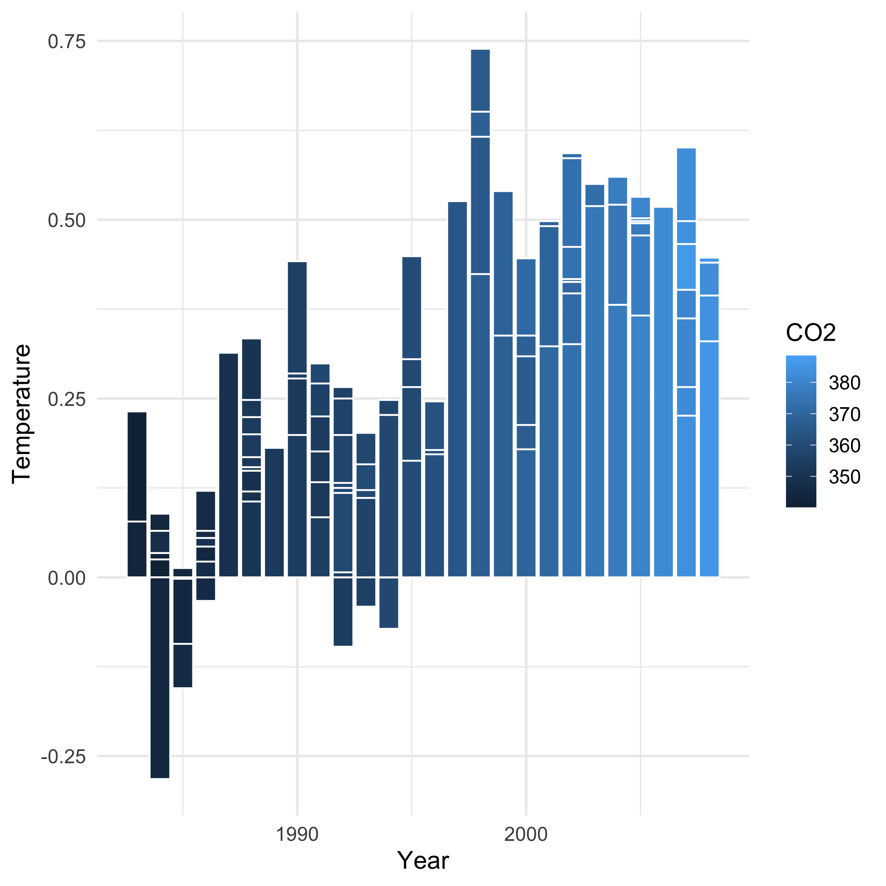
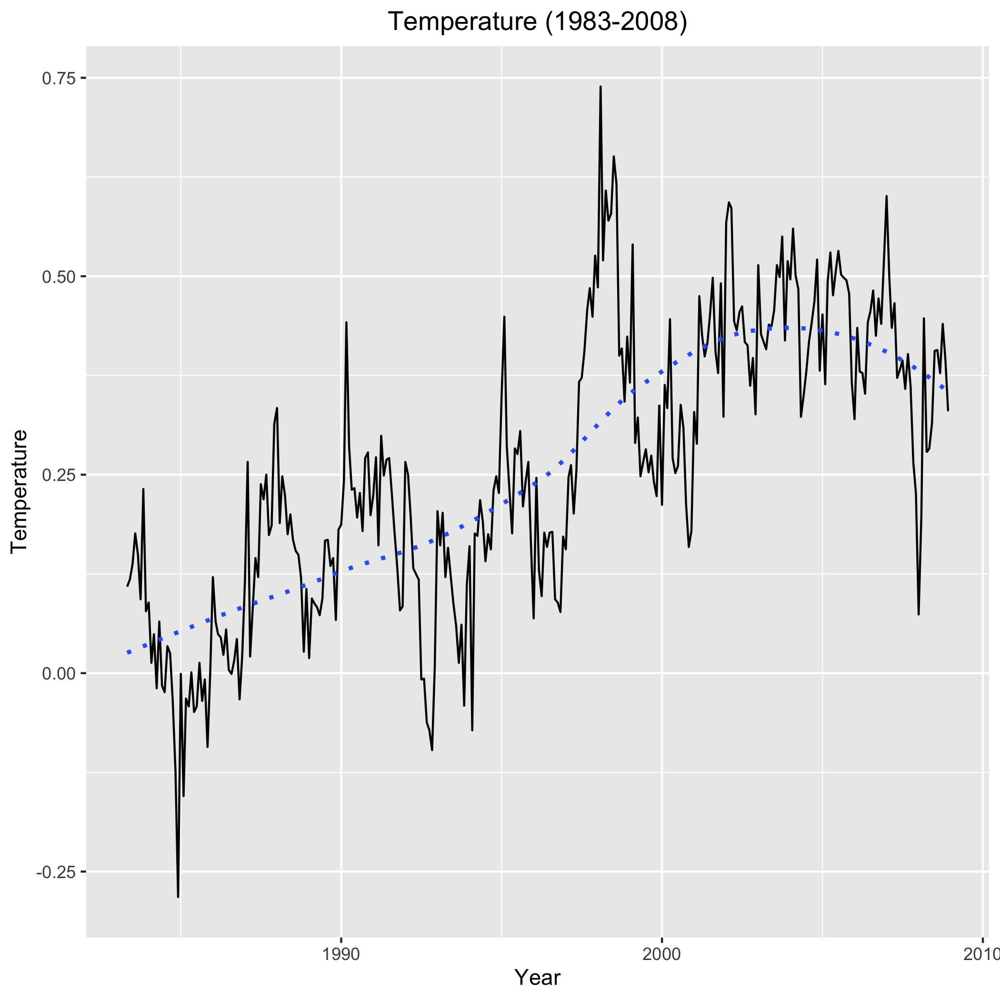

## Table of contents

- [Preparation](#prep)

- [1. Collaborating with ``branches``](#collaborating-with-branches)

	- [1.1 ``penguin`` invites ``puffin``](#penguin-invites-puffin)

	- [1.2 ``penguin`` generates initial content](#penguin-generates-initial-content)

	- [1.3  Configure local repository and push upstream](#configure-local-repository-and-push-upstream)
	
	- [1.4 ``puffin`` clones the repo](#puffin-clones-the-repo)

	- [1.5 ``puffin`` creates a new branch](#puffin-creates-a-new-branch)

	- [1.6 ``puffin`` pushes new branch upstream](#puffin-pushes-new-branch-upstream)

	- [1.7 ``penguin`` merges the new branch into main](#penguin-merges-the-new-branch-into-main)

- [2. Collaborating with ``forks``](#collaborating-with-forks)

<br><br>

A few weeks ago, we learned how to contribute to a Github repository on which you are a collaborator. The goal was to modify the content directly.  This works if two conditions are met:

- You are not editing/deleting content created by other collaborators on the repo, and
- You are adding files/folders that were not previously present

This may not always be the case.  In fact, it's possible that you and your collaboror(s) on this repository may be contributing edits and additions to the same files and folder simultaneously.  This will undoubtedly create conflicts which will need to be resolved by at least one person with appropriate permissions to the repo.

But, there are far better ways to collaborate on GitHub without runnign into these pesky problems! We will be visiting two main techniques today.


<Br><br><br><br>
<Br><br><br><br>
<Br><br><br><br>
<Br><br><br><br>
<Br><br><br><br>
<Br><br><br><br>
<Br><br><br><br>
<Br><br><br><br>
<Br><br><br><br>
<Br><br><br><br>
<Br><br><br><br>
<Br><br><br><br>
<Br><br><br><br>
<Br><br><br><br>
<Br><br><br><br>
<Br><br><br><br>
<Br><br><br><br>
<Br><br><br><br>


## Prep

For today's exercise, you will be performing roles of two collaborators simultaneously. For this reason, do the following:

1. Get a second github account (first, you will need to get a second email address. You can't use the same email address for two different github accounts).

2. Sign into this new account using an incognito browser window

3. Sign into your regular github account using normal browser window

We will refer to these two accounts as follows.  Your account names will be different obviously, so make sure to keep track of which is which.

- ``penguin`` (original account)

- ``puffin`` (the incognito account)

4. for the incognito account, go ahead and generate a new ssh key-pair as follows.  Note that it's not necessary to generate a separate key. In fact, you can use the same ssh-key pair for both accounts and setting up ``~/.ssh/config`` file accordingly. But I have found it to be a hassle and having separate keys simplifies things.  


```bash
ssh-keygen -t rsa -b 4096 -C "your_new_email@host.com"
```
- Remember that if you will want to name this key differently than the default ``id_rsa.*``.  I would something like ``id_rsa_puffin`` where ``puffin`` refers to your second github account.


5. Add information on your new key to the ``~/.ssh/config`` file as follows:

```bash
Host puffin.github.com
	HostName github.com
	User git
	PreferredAuthentications publickey
	IdentityFile ~/.ssh/id_rsa_puffin
```


6. Associate your new public key with your new github account.

```bash
cd ~/.ssh/

pbcopy < id_rsa_puffin.pub
```


7. In your incognito browser window, go inside your github account, and add the copied key.  Name it accordingly on the website form.

8. Now you are ready to rock n roll.


<br><br>

## 1. Collaborating with ``branches``

This section assumes that your workflow is that of a collaborator. 

<br>

### 1.1 ``penguin`` invites ``puffin``

1. With your ``penguin`` account, create a new **private** repository named ``climate``.

2. Leave all options unchecked

3. Invite your ``puffin`` account as a collaborator

4. In your ``puffin`` account, accept the invitation


<br>

### 1.2 ``penguin`` generates initial content

1. Create a folder named ``climate`` and initialize it as a git repo

```r
cd ~/Github

mkdir climate

cd climate

git init
```

2. Create a README.md and generate following content in it.


```bash
---
title: Climate Change from 1983 to 2008
---


## Exploratory Data Analysis (EDA)

- Import the data into R and check variable names.
```

```r
library(tidyverse)
library(plotly)
library("RColorBrewer")

climate <- read_csv("data/climate_change.csv")

names(climate)

```

```bash
- Check how the data is organized
```

```r
str(climate)

spec_tbl_df [308 × 11] (S3: spec_tbl_df/tbl_df/tbl/data.frame)
 $ Year    : num [1:308] 1983 1983 1983 1983 1983 ...
 $ Month   : num [1:308] 5 6 7 8 9 10 11 12 1 2 ...
 $ MEI     : num [1:308] 2.556 2.167 1.741 1.13 0.428 ...
 $ CO2     : num [1:308] 346 346 344 342 340 ...
 $ CH4     : num [1:308] 1639 1634 1633 1631 1648 ...
 $ N2O     : num [1:308] 304 304 304 304 304 ...
 $ CFC-11  : num [1:308] 191 192 193 194 194 ...
 $ CFC-12  : num [1:308] 350 352 354 356 357 ...
 $ TSI     : num [1:308] 1366 1366 1366 1366 1366 ...
 $ Aerosols: num [1:308] 0.0863 0.0794 0.0731 0.0673 0.0619 0.0569 0.0524 0.0486 0.0451 0.0416 ...
 $ Temp    : num [1:308] 0.109 0.118 0.137 0.176 0.149 0.093 0.232 0.078 0.089 0.013 ...
 - attr(*, "spec")=
  .. cols(
  ..   Year = col_double(),
  ..   Month = col_double(),
  ..   MEI = col_double(),
  ..   CO2 = col_double(),
  ..   CH4 = col_double(),
  ..   N2O = col_double(),
  ..   `CFC-11` = col_double(),
  ..   `CFC-12` = col_double(),
  ..   TSI = col_double(),
  ..   Aerosols = col_double(),
  ..   Temp = col_double()
  .. )
```

```bash
- Explore the change in CO2 levels over the years using a barplot.
```

```r
climate_change_chart <- ggplot(climate, aes(x = Year, y = Temp, fill = CO2)) + 
	xlab("Year") +
	ylab("Temperature") + 
	theme_minimal(base_size = 14)
```

```r
barplot <- climate_change_chart +
	geom_bar(position = "dodge", stat = "identity", color = "white")

ggplotly(barplot)

ggsave("co2_1983_2008.png")
```

```html
<center>

</center>
```

3. Save and close the file.


<br>

### 1.3 Configure local repository and push upstream

1. Tell git about your github repo

```bash
git config user.name "penguin"

git config user.email "penguin@arctic.info"

git remote add origin git@github.com:penguin/climate.git
```


2. Now ``add``, ``commit`` and ``push`` the repo upstream.

```r
git add .

git commit -m "initial commit by penguin"

git push -u origin master
```


<br>

### 1.4 ``puffin`` clones the repo

```bash
cd ~/

mkdir Github2

cd Github2

ssh-add ~/.ssh/id_rsa_puffin

git clone git@github.com:penguin/climate.git
```


### 1.5 ``puffin`` creates a new branch

- User puffin wants to update the README.md, but instead of directly updating it within the main branch, they open a new repo branch.

```bash
git branch

* master
```

- This shows that currently only one branch exists.

```bash
git checkout -b puffin-update
```

- Now open README.md and start updating it. The climate data contains time series data from year 1983 through 2008. It might be interesting to look at change in temperature over the years using a line plot.

```bash
## Temperature changes through time
```

```r
library(lubridate)

climate_change_ymd <- climate %>% 
	mutate(year_month = ymd(paste(climate$Year, climate$Month, truncated = 1)))

L1  <- ggplot(climate_change_ymd, aes(year_month, Temp)) +
	geom_line() +
	geom_smooth(se=FALSE, linetype="dotted") +
	labs(title = "Temperature (1983-2008)",
		x = "Year",
		y = "Temperature") +
	theme(plot.title = element_text(hjust=0.5))

ggplotly(L1)

ggsave("temperature_years.png")
```

```html
<center>

</center>
```

<br>

### 1.6 ``puffin`` pushes new branch upstream

- First configure your user name and email for the cloned repo

```bash
git config user.name "puffin"
git config user.email "puffin@arctic.com"

git config --list
git remote -v
```

- Then ``add``, ``commit`` and ``push`` the new branch upstream

```bash
git add .

git commit -m "Updated README.md

git push -u origin puffin-update
```


### 1.7 ``penguin`` merges the new branch into main

- Go to the github account for penguin and visit the repo located at ``https://github.com/penguin/climate``.

- In the ``Pull requests`` tab, choose ``new pull request``

- From the dropdown menu, choose 
	
	- compare: puffin-update
	- base: main

- Then hit ``Create pull request``.

- Github will notify you if this branch can be merged or if there are any conflicts to be resolved. Take appropriate action.


<br><br><br><br>


## 2. Collaborating with ``forks``


