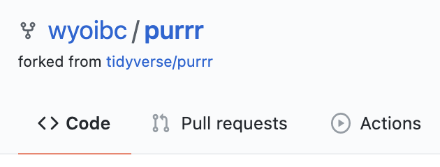

### Video recording for this session

<br>
<center>

</center>
<br><br>


## Table of contents

- [Introduction](#introduction)

- [1. Forking vs Cloning](#forking-vs-cloning)

- [2. Contributing as a non-collaborator](#contributing-as-a-non-collaborator)

	- [2.1 ``penguin`` creates a new repo](#penguin-creates-a-new-repo)

	- [2.2 ``penguin`` generates initial content](#penguin-generates-initial-content)

	- [2.3 ``penguin`` pushes the package to github](#penguin-pushes-the-packages-to-github)
	
	- [2.4 ``puffin`` installs the package](#puffin-installs-the-packages)

	- [2.5 ``puffin`` forks the package repository](#puffin-forks-the-package-repository)

	- [2.6 ``puffin`` sets up repo for contribution](#puffin-sets-up-repo-for-contribution)

	- [2.7 ``puffin`` adds more functionality to the package](#puffin-adds-more-functionality-to-the-package)

	- [2.8 ``puffin`` pushes updates to the fork](#puffin-pushes-updates-to-the-fork)

	- [2.9 ``puffin`` creates a pull request](#puffin-creates-a-pull-request)

	- [2.10 ``penguin`` examines and resolves the pull request](#penguin-examines-and-resolves-the-pull-request)


<br><br>

## Introduction

Last week we looked at better ways of contributing to a repository on GitHub when you are a collaborator.  This may not always be the case.  Often times, development of open source software is brought about by contributions from active users who are not official collaborators on a project. 

Take any popular R package on GitHub and look at how many people contributed code towards continuing development of that project.  Chances are that many of them are not official collaborators.  This week, we will learn how to contribute on github in such circumstances using forks.

<Br><br><br><br>
<Br><br><br><br>
<Br><br><br><br>
<Br><br><br><br>
<Br><br><br><br>
<Br><br><br><br>
<Br><br><br><br>
<Br><br><br><br>
<Br><br><br><br>
<Br><br><br><br>
<Br><br><br><br>
<Br><br><br><br>
<Br><br><br><br>
<Br><br><br><br>
<Br><br><br><br>
<Br><br><br><br>
<Br><br><br><br>
<Br><br><br><br>


## 1. Forking vs Cloning


- What is forking anyway?  Let's visit Github page for one of the tidyverse packages: ``purrr``.

<br>
<center>

</center>
<br>

- Take a look at the top right corner on the package page. You will see something like above.  This indicates how many people are watching the repo for updates (watch + star) and how many have forked the repository for further development. 

- Assuming you are currently logged into your account on github, click on the ``Fork`` button on the purrr repo.  Notice that GitHub will transfer you to your own account where a copy of the purrr repository will be created. It will appear as follows:


<br>
<center>

</center>
<br>

- The difference between forking and cloning should be clear now.  Cloning is making a copy of a repo on your local computer, whereas forking is doing the same thing on GitHub.

<Br><br>

## 2. Contributing as a non-collaborator

- Our workflow for Github collaboration begins here. You will still need two github accounts like last time, but we will work them a bit differently now.


<br>

### 2.1 ``penguin`` creates a new repo

- First, using your original account, create a new repo, and name it ``mkhist``.  Keep it **public**.

- Unlike last week, you will not create any collaborators on this repo. 


<br>

### 2.2 ``penguin`` creates a R package 

- On your local computer, create a new folder named after the repo and generate a new ``README.md``.


```bash
cd ~/Github && mkdir mkhist && cd mkhist

git init

touch README.md
```

- Write an R function to generate histograms from each variable of the dataframe


```r
library(tidyverse)

mkhist <- function(x){
	print(x %>% head())
	x %>% gather() %>% head()

	ggplot(gather(x), aes(value)) +
		geom_histogram(bins=20) + 
		facet_wrap(~key, scales='free_x')
}


```


<br>

### 2.3 ``penguin`` pushes the package to github


<br>

### 2.4 ``puffin`` installs the package 


<br>

### 2.5 ``puffin`` forks the package repository


<br>

### 2.6 ``puffin`` sets up repo for contribution


### 2.7 ``puffin`` adds more functionality to the package


<br>


### 2.8 ``puffin`` pushes updates to the fork


<br>

### 2.9 ``puffin`` creates a pull request

<br>

### 2.10 ``penguin`` examines and resolves the pull request


